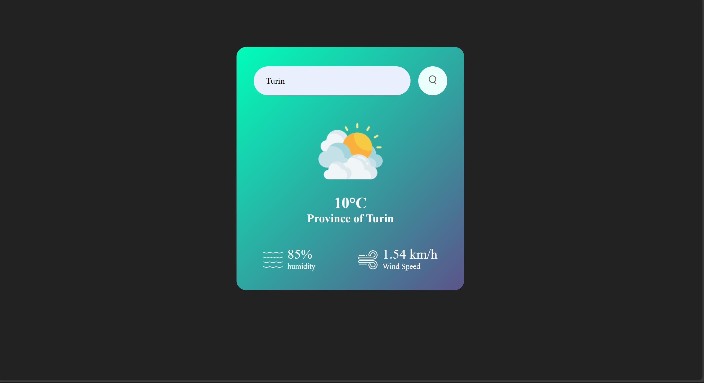

# 🌤️ Weather App

A simple and elegant **Weather App** built with HTML, CSS, and JavaScript.  
It fetches real-time weather data using the [OpenWeatherMap API](https://openweathermap.org/api) and displays temperature, location, humidity, and wind speed.

---

## 🚀 Features
- 🔎 Search weather by city name.
- 🌡️ Displays **temperature**, **location**, **humidity**, and **wind speed**.
- 🎨 Gradient card design with responsive UI.
- ⚡ Fetches live weather data via OpenWeatherMap API.

---

## 🛠️ Tech Stack
- **HTML5**
- **CSS3**
- **JavaScript (Vanilla JS)**
- **OpenWeatherMap API**

---

## 📸 Preview



---

## ⚙️ Installation & Setup

1. Clone this repository:
   ```bash
   git clone https://github.com/AnasKhan322/Weather-app.git
   cd Weather-app
